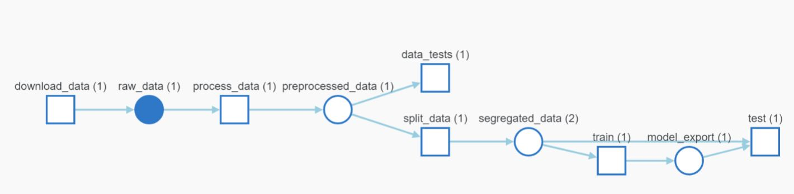
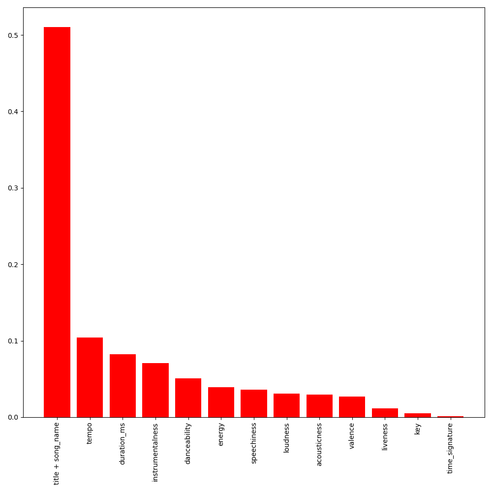

# ML Pipeline
An end to end machine learning classification model trained using Random Forest.

## Debugging.  
* When developing, you can override the parameter ``main.execute_steps`` to only execute one or
  more steps of the pipeline, instead of the entire pipeline. 
  For example, this only executes the ``random_forest`` step:
  ```bash
  mlflow run . -P hydra_options="main.execute_steps='random_forest'"
  ```
  and this executes ``download`` and ``preprocess``:
  ```bash
  mlflow run . -P hydra_options="main.execute_steps='download,preprocess'"
  ```

## Run Production version
upload results to wandb
`mlflow run . -P hydra_options="main.project_name=genre_classification_prod"`
then change artifact release alias to prod.

## Pipeline Graphical Overview


## Sample Output
**Feature Importance**



## Run the release

`mlflow run https://github.com/1ayham1/genre_classification.git -v 1.0.0 -P hydra_options="main.project_name=remote_execution" `

## Deployment
`wandb artifact get genre_classification_prod/model_export:prod --root model`

Get artificate for testing:

` wandb artifact get genre_classification_prod/data_test.csv:latest `

### Offline inference

```
mlflow models predict -t csv -i ./artifacts/data_test.csv:v0/data_test.csv -m model
```

### Online inference
set a RESTful API
```
mlflow models serve -m model &
```
open jupyter and test

```
import requests
import json

with open("model/input_example.json") as fp:
    data = json.load(fp)

results = requests.post("http://localhost:5000/invocations", json=data)

print(results.json())

```


